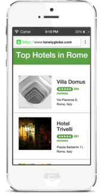

### UpUp - Kickstarting the Offline-First Revolution
<a href="https://www.talater.com/upup/"></a>

UpUp is a tiny javascript library that makes sure your users can always access your site's content, even when they're on a plane, in an elevator, or 20,000 leagues under the sea.

Mobile-First has become the de-facto standard for building modern sites. But in a world where everyone is mobile, an always-on connection isn't something we can rely on. It's time to start thinking **Offline-First**.

With UpuUp you control the content your users see, even when they are offline. And you can do it with just a single JavaScript command.

### Demo & Tutorial
The easiest path to understanding, is to see [UpUp in action, and try a quick tutorial](https://www.talater.com/upup/).

### Hello World
Getting started with UpUp is as easy as adding two javascript files to your site, [upup.min.js](https://raw.githubusercontent.com/TalAter/UpUp/master/dist/upup.min.js) & [upup.sw.min.js](https://raw.githubusercontent.com/TalAter/UpUp/master/dist/upup.sw.min.js), and defining the content you want your users to see when they are offline.

For example:
````html
<script src="/upup.min.js"></script>
<script>
UpUp.start({
  'content-url': 'offline.html',
  'assets': ['/img/logo.png', '/css/style.css', 'headlines.json']
});
</script>
````
Now every time your users return to your site and their connection is down, they will see the contents of `offline.html` instead of an error.

**Check out some [live demos and a full tutorial](https://www.talater.com/upup/). Once you're up and rolling, you can read the full [API Docs](https://github.com/TalAter/UpUp/blob/master/docs/README.md).**

### HTTPS Requirement
UpUp requires a secure connection to your site (this is a requirement of ServiceWorkers, the technology at the heart of UpUp). So make sure your users visit your site over HTTPS (an SSL certificate can be as cheap as $5).

### Browser Support
UpUp works in any browser that supports ServiceWorkers. Currently this means:
* Chrome 40+
* Opera 27+
* Firefox 41+

If your users are using a different or older browser, they will simply be unaffected by UpUp. Nothing will break, and they simply won't notice anything different.

### Technical Documentation and API
[Docs and full API reference](https://github.com/TalAter/UpUp/blob/master/docs/README.md)

### Author
Tal Ater: [@TalAter](https://twitter.com/TalAter)

### License
Licensed under [MIT](https://github.com/TalAter/annyang/blob/master/LICENSE).
